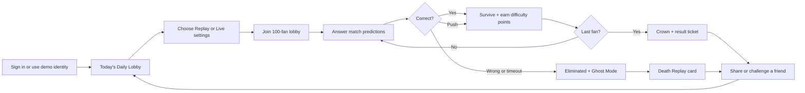
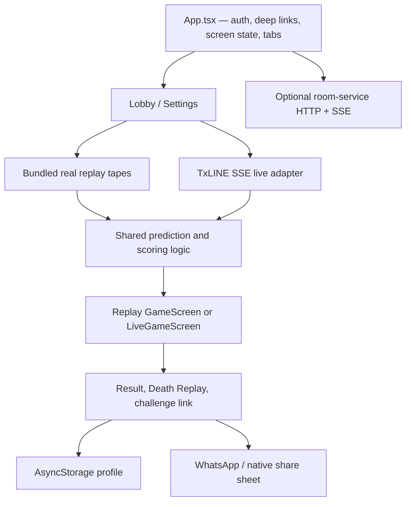

# Hi-Lo Royale — Product and Engineering Handoff

This document explains what Hi-Lo Royale is, how a player experiences it, how the current implementation works, and what a collaborator should know before changing it.

## The short version

**Hi-Lo Royale is a football prediction survival game.** One hundred fans enter a match lobby. During the match, each fan answers short predictions driven by real match events: higher or lower, yes or no, one team or the other, halftime props, and VAR outcomes.

- A correct pick keeps the player alive.
- A wrong pick or timeout eliminates the player.
- A tied result is a push and nobody is eliminated.
- The last surviving fan wins the crown.

It combines the tension of a battle royale, the accessibility of a two-choice trivia game, and the credibility of real TxLINE sports data. The current product is points-only; it does not take wagers or pay cash prizes.

## Product thesis

Most sports prediction products feel like forms or betting slips. Hi-Lo Royale is designed to feel like a live game show:

1. The crowd visibly chooses sides.
2. The timer and haptics create urgency.
3. Wrong answers eliminate many avatars in a dramatic cascade.
4. Rare correct predictions earn more points than obvious ones.
5. Every run produces something worth sharing—even a loss.

The core sentence is:

> 100 fans enter. Every match window is a prediction. Wrong means eliminated. Last fan standing takes the crown.

## End-to-end player journey



### 1. Identity

The first screen offers:

- Google OAuth through `expo-auth-session`, when client IDs are configured.
- A clearly labeled local demo identity when OAuth is not configured.

Google is used only for basic profile identity. The app never requests Gmail or IMAP mailbox access.

### 2. Daily Lobby

The Play tab opens a shared Daily Lobby. The current offline implementation hashes the device's local `YYYY-MM-DD` date and selects one of three bundled real World Cup match tapes:

- Argentina vs Switzerland — fixture `18222446`
- France vs Spain — fixture `18237038`
- England vs Argentina — fixture `18241006`

This gives the product a Wordle-like “did you survive today's match?” loop without requiring a scheduling backend. A production version should use a server-defined UTC rollover so every timezone changes lobby simultaneously.

The lobby also shows the matchup, room identity, current player count, hot upcoming predictions, player progress, and a notification opt-in.

### 3. Match Control

The settings screen separates two modes:

| Mode | Behavior |
|---|---|
| Replay | Uses a bundled real historical TxLINE tape. Supports 1×, 15×, 30×, and 60× playback. |
| Live | Connects to the TxLINE score SSE endpoint. Always runs at real 1× match time. |

Players can also choose:

- 8, 10, or 15 seconds to answer.
- 2, 4, or 6 seconds for the result reveal.

The recommended hackathon/demo setting is Replay at 30×, with a 10-second answer window and a 4-second reveal.

### 4. Match gameplay

A normal replay builds roughly 9–10 predictions from the real event tape. The schedule can include:

- Pregame prop: for example, “Will there be a goal before halftime?”
- Rolling comparison: more or fewer corners/shots/cards than the previous window.
- Occurrence question: for example, “Will there be a card in the next 10 minutes?”
- Team side-pick: which team will have more of a stat in the window?
- Halftime special.
- Reactive VAR question based on a real review and verdict.

Every question is represented internally as `hi`, `lo`, or `push`, even when the UI labels are YES/NO or team codes. This keeps judging, bot behavior, streaks, and elimination logic shared across question types.

During each round the player sees:

- The question and match-minute window.
- Large cyan HI and red LO answer controls.
- A live crowd split showing how the lobby is leaning.
- A countdown timer with a haptic heartbeat near expiry.
- The remaining fan count and elimination grid.
- The next predictions in the queue.
- The current streak and crowd-difficulty points.

When three or fewer fans remain, the game enters **Sudden Death** and limits the answer window to three seconds.

### 5. Elimination and Ghost Mode

An eliminated player is not thrown out of the experience. The match continues in Ghost Mode and shows the rank the player would hold if still alive: “you would now be top N.”

Ghost rounds are informational only. They cannot change the eliminated player's score, streak, history, or badges.

### 6. Results and sharing

At the end of a run the app calculates progression, stores the profile, and produces a visual result ticket.

Winning produces a crown/survival card. Losing produces a **Death Replay** card containing:

- The fatal question.
- The player's pick and correct answer.
- Match minute and round.
- The percentage of fans who were correct.
- How many other fans were eliminated at the same moment.
- Final score and run totals.

The captured card can be shared through the native share sheet, including Instagram-compatible image sharing. WhatsApp has a dedicated share action.

### 7. Beat-my-run challenges

A result can create a deterministic deep link:

```text
hiloroyale://challenge/<fixtureId>?p=<compact-picks>&target=<points>
```

The link contains only the fixture, compact HI/LO picks, and target score—no personal profile data. A friend who opens it receives the same replay schedule and sees the sender's ghost pick round by round.

Squad invites use:

```text
hiloroyale://squad/<code>
```

## Scoring

### Prediction points

Correct picks are weighted by how many fans found the correct side:

```text
prediction points = round(10 + 40 × (1 - correct fan share))
```

Examples:

| Fans who got it right | Points for a correct pick |
|---:|---:|
| 90% | 14 |
| 50% | 30 |
| 5% | 48 |

This rewards difficult, contrarian reads. A wrong pick does not gain points merely because it was unusual.

- Correct: weighted prediction points.
- Wrong: 0 prediction points and elimination.
- Timeout: 0 prediction points and elimination.
- Push: 0 prediction points; player survives.

### Final ladder points

```text
ladder points = prediction points + fans outlived + crown bonus
crown bonus = 250 points
```

The local profile persists ladder points, crowns, lobbies played, best streak, question accuracy, performance by stat category, and unlocked badges.

### Badges

- **Ice Veins:** correct pick with under 1.5 seconds left.
- **Comeback King:** survive a near-death round.
- **Perfect Round:** every recorded question correct in the match.
- **Crowd Breaker:** correct while opposing the crowd majority.

## Retention and viral loops

The product is built around three connected loops:

### Return loop

- One featured Daily Lobby.
- Persistent profile, ladder, crowns, and badges.
- Local lobby reminders and survival notifications.
- A future server-defined daily streak and push system can build on this foundation.

### Session-drama loop

- Crowd-was-wrong reveals.
- Haptic heartbeat and near-death moments.
- Large elimination cascades.
- Three-second Sudden Death.
- Ghost Mode regret after elimination.

### Invite loop

- Shareable win cards and Death Replay cards.
- WhatsApp and native/Instagram sharing.
- Deterministic beat-my-run links.
- Squad codes and deep-link invites.

## Data, trust, and Solana

### Replay data

Historical TxLINE events are pulled ahead of time, normalized, and generated into TypeScript modules under `src/lib/real-data/`. They are bundled with the app, so replay mode works without API credentials or a network connection.

The generator is:

```text
scripts/gen-real-data.js
```

### Live data

Live mode reads:

```text
GET /api/scores/stream?fixtureId=…
```

over Server-Sent Events. Live outcomes are resolved from events as the real stat window closes; they are not precomputed.

### On-chain proof

Fixture `18222446` includes a real devnet `validateStatV2` transaction proving its final score against TxODDS's on-chain Merkle root. The result screen links to Solscan when a replay has a proof.

Not every bundled fixture currently has a proof. The UI shows proof only when one exists.

## Current product status

This distinction matters when demonstrating the product or planning work:

| Area | Current status |
|---|---|
| Native replay gameplay | Shipped using real bundled match tapes. |
| Daily Lobby | Shipped; deterministic by local device date. |
| Crowd-difficulty scoring | Shipped in the native app and covered by shared logic tests. |
| Sudden Death, Ghost Mode, Death Replay | Shipped in the native app. |
| Challenge and squad deep links | Shipped. |
| Profile, badges, local progression | Shipped with AsyncStorage. |
| Image/WhatsApp/native sharing | Shipped. |
| Google login | Implemented; requires OAuth client IDs. Guest identity works without them. |
| Live TxLINE mode | Implemented; requires fixture ID and activated token. |
| Cross-device presence | Demo room service implemented; requires deployment/configuration. |
| Global/Friends/Squads rankings | Currently deterministic demo data, labeled as such in the UI. Not authoritative multiplayer rankings. |
| Squad members/streak/bonus copy | Product concept UI. The room join can be real when configured, but displayed population and squad scoring are not yet authoritative. |
| Solana verification | One bundled replay has a real devnet proof. |
| Web version | Responsive mirror exists. The latest Daily/Ghost web loop is in GitHub PR #1 until merged. |

## Technical architecture



### Stack

- Expo SDK 54
- React Native 0.81
- React 19
- TypeScript
- Plain React Native `StyleSheet`; no Tailwind or styled-components
- `AsyncStorage` for local persistence
- `expo-auth-session` for Google OAuth
- `expo-notifications` and `expo-haptics`
- `react-native-view-shot` for share-card PNG capture
- A zero-dependency Node room service for demo presence

Navigation is intentionally a small screen state machine in `App.tsx`, not a navigation library.

## Repository map

```text
06-builds/
├── t2-hilo-royale-ios/              Native Expo app (primary product)
│   ├── App.tsx                      Auth gate, deep links, screen state, tabs
│   ├── src/theme.ts                 Neon palette, typography helpers, fan data
│   ├── src/types.ts                 Result, round, challenge, death types
│   ├── src/screens/
│   │   ├── LoginScreen.tsx          Google/guest identity
│   │   ├── LobbyScreen.tsx          Daily match hub
│   │   ├── SettingsScreen.tsx       Replay/live and pacing controls
│   │   ├── GameScreen.tsx           Replay game loop
│   │   ├── LiveGameScreen.tsx       Live SSE game loop
│   │   ├── ResultScreen.tsx         Ticket, proof, badges, sharing
│   │   ├── RankScreen.tsx           Demo leaderboard surfaces
│   │   ├── SquadScreen.tsx          Squad UI, codes, deep links
│   │   └── ProfileScreen.tsx        Progress and badges
│   ├── src/lib/
│   │   ├── game-logic.ts            Questions, judging, scoring, daily/ghost helpers
│   │   ├── txline-real.ts            Replay catalog and selector
│   │   ├── live-service.ts           TxLINE live SSE adapter
│   │   ├── room-service.ts           Cross-device room client
│   │   ├── storage.ts                Persistent player profile
│   │   ├── auth.ts                   Persistent identity
│   │   ├── settings.ts               Persistent match settings
│   │   └── real-data/                Generated real match tapes and proof
│   ├── server/room-server.js         In-memory demo presence service
│   └── RUN.md                        Detailed run/build notes
├── t2-hilo-royale/                  Responsive web version and logic tests
│   ├── index.html
│   ├── game-logic.js                JavaScript mirror of native logic
│   └── test.js                      Shared behavior tests
└── shared/                          TxLINE pulling, normalization, and cached fixtures
```

Design references are stored in:

```text
04-pitch-decks/track2/GOOD/hilo-ios-layout-options/
04-pitch-decks/track2/GOOD/hilo-ios-neon-expanded-flow/
```

Together these folders currently contain 18 app mockup images.

## Running locally

From the native app folder:

```powershell
corepack pnpm install
corepack pnpm start
```

Scan the Expo QR code with Expo Go on an iPhone connected to the same network. If LAN discovery fails:

```powershell
corepack pnpm tunnel
```

Run the type checker with:

```powershell
pnpm run typecheck
```

Run the shared logic tests from the web app folder:

```powershell
cd ..\t2-hilo-royale
node test.js
```

The `main` branch currently runs 91 assertions covering question generation, resolution, elimination, streaks, bots, survival framing, ladder behavior, richer question types, and a full simulated lobby. GitHub PR #1 extends the mirror to 107 assertions by adding crowd-difficulty scoring, Daily Lobby selection, ghost encoding, and Sudden Death coverage.

## Optional environment configuration

### Google OAuth

```powershell
$env:EXPO_PUBLIC_GOOGLE_WEB_CLIENT_ID='<web OAuth client id>'
$env:EXPO_PUBLIC_GOOGLE_IOS_CLIENT_ID='<iOS OAuth client id>'
pnpm start
```

### TxLINE live mode

```powershell
$env:EXPO_PUBLIC_HILO_API_URL='https://hilo-royale.vercel.app'
$env:EXPO_PUBLIC_TXLINE_FIXTURE_ID='<live fixture id>'
$env:EXPO_PUBLIC_TXLINE_KICKOFF_MS='<fixture kickoff as Unix milliseconds>'
$env:EXPO_PUBLIC_LIVE_TEAM_1='<team one>'
$env:EXPO_PUBLIC_LIVE_TEAM_2='<team two>'
pnpm start
```

`TXLINE_JWT` and `TXLINE_API_TOKEN` belong only in the backend environment.
Never expose either through an `EXPO_PUBLIC_*` variable.

The native Live choice is available only from 15 minutes before the configured
kickoff through three hours afterward. Verify the backend SSE stream before a
stage demo; otherwise use the deterministic replay path. The checked-in default
is Spain–Argentina (`18257739`, 19 July 2026 at 19:00 UTC). If the fixture is
overridden, kickoff and both team variables must be overridden with matching
metadata too.

Never commit these values. Expo `EXPO_PUBLIC_` variables are compiled into the client and are not secret storage; production should proxy privileged access through a backend with short-lived user/session authorization.

### Cross-device room presence

Terminal one:

```powershell
$env:PORT=8787
pnpm room-server
```

Terminal two:

```powershell
$env:EXPO_PUBLIC_HILO_API_URL='http://YOUR-LAN-IP:8787'
pnpm start
```

The included server stores presence in memory and expires inactive players after 15 minutes. Before production it needs HTTPS, durable storage, authenticated room tokens, rate limiting, abuse controls, and authoritative score submission.

## Rules for collaborators

1. Keep native and web game logic aligned. Important rule changes should be mirrored between `src/lib/game-logic.ts` and `../t2-hilo-royale/game-logic.js`.
2. Add or update tests whenever scoring, question resolution, Daily selection, ghost encoding, or survival rules change.
3. Never silently present simulated data as live production data. The current leaderboard labels are deliberate.
4. Never commit TxLINE tokens, OAuth secrets, signing keys, or room credentials.
5. Preserve the core two-choice interaction. New question formats should still resolve to `hi`, `lo`, or `push` unless the whole rules engine is intentionally redesigned.
6. Treat replay and live as different integrity models: replay schedules can be precomputed; live outcomes must be derived only after their real window closes.
7. Test on an actual iPhone after major interaction changes. Haptics, share sheets, notifications, deep links, and safe-area behavior cannot be fully verified in a desktop browser.
8. Keep the experience points-only until legal review, age gating, responsible-play controls, payment custody, and jurisdiction-specific compliance exist.

## Recommended next priorities

### Priority 0 — authoritative backend

- Server-defined UTC Daily Lobby.
- Authenticated users and room sessions.
- Durable lobby, squad, score, and challenge storage.
- Server-authoritative rankings and anti-cheat validation.
- Real presence rather than simulated 100-fan population where traffic permits.

### Priority 1 — social retention

- Persist challenges so senders can see who accepted and who won.
- Real friends and rival relationships.
- Stateful push notifications for rivals, daily lobby kickoff, and squad activity.
- Daily participation streak and streak freeze.

### Priority 2 — operations and content

- Admin tools for fixture selection and match scheduling.
- Expand and validate the replay catalog.
- Analytics for lobby entry, round completion, elimination, sharing, and challenge conversion.
- Automated replay/proof generation pipeline.

### Priority 3 — production hardening

- Error monitoring and structured event logging.
- Accessibility, localization, and reduced-motion audit.
- App Store assets, privacy policy, terms, account deletion, and support flow.
- Load testing for room SSE connections and live match spikes.

## Useful links

- Repository: <https://github.com/lordofclaude/solana-txodds-hackathon>
- Latest web viral-loop PR: <https://github.com/lordofclaude/solana-txodds-hackathon/pull/1>
- Native run/build notes: [`RUN.md`](./RUN.md)
- Room service notes: [`server/README.md`](./server/README.md)
- Web viral strategy: [`../t2-hilo-royale/VIRAL-PLAYBOOK.md`](../t2-hilo-royale/VIRAL-PLAYBOOK.md)

## Final mental model

Hi-Lo Royale is not simply a list of football questions. The real product is the loop:

> Real match data creates the question → the crowd creates pressure → elimination creates spectacle → the result creates a share → the share brings back a friend → tomorrow's Daily Lobby restarts the cycle.

Any feature should strengthen at least one part of that loop without weakening data integrity or misrepresenting demo infrastructure as production multiplayer.
